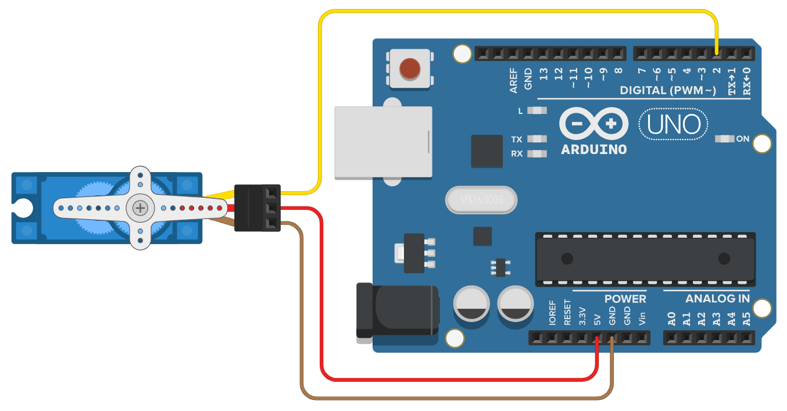

# OO-Servo

OO-Servo is an advanced servo motor that goes far beyond standard hobby servos.
It supports multi-turn absolute positioning (±524,287 rotations), speed adjustment (max 700°/s), and real-time angle reading, while maintaining the same size and wiring compatibility as the SG90.

**Note:** This library works only with OO-Servo hardware and cannot be used with standard hobby servo motors (e.g., SG90, MG996R).  
The OO-Servo hardware can be purchased here: [Buy OO-Servo](https://example.com)


## Features
* Supports extended angles up to ±188,743,320° (±524,287 full rotations)
* Angle accuracy: ±1°
* Dedicated library with intuitive `attach()` and `write()` methods, compatible with the standard Arduino Servo library
* Adjustable speed range: 1–700 °/s
* Real-time angle reading
* Same wiring and dimensions as SG90


## Mechanical Specifications
* Operating Voltage: 5V
* Maximum Rotation Speed: 700°/s (0.086sec/60°, 117rpm)
* Stall Torque: 2 kgf cm
* Gear Material: plastic
* Dimensions: same as SG90
* Wiring: Same as SG90 (3-pin: VCC, GND, Signal)


## Wiring Example
This motor uses the same wiring as a standard SG90 servo:
| Wire Color | Function | Connect to          |
|------------|----------|---------------------|
| Red        | VCC      | 5V Supply           |
| Brown      | GND      | Arduino GND         |
| Yellow     | Signal   | Arduino digital pin |




## Speed Parameter
The `speed` argument must be an integer between 0 and 255.  
Speed value is calculated as:**Speed = Angular Velocity [°/s] × 255 / 700**
| Speed (0–255) | Angular Velocity [°/s] |
|---------------|---------------------|
| 0             | 0 °/s (no rotation) |
| 1             | 2 °/s               |
| 127           | 348 °/s             |
| 255           | 700 °/s (max speed) |


## Class Methods

### `attach(pin)`
Attach a servo motor to the specified pin.  
**Arguments:**  
- `pin`: `uint8_t` — Arduino pin number.

---

### `attach(pin, hold)`
Attaches a servo motor to an i/o pin.
**Arguments:**  
- `pin`: `uint8_t`  
- `hold`: `bool` — If `false`, the motor does not hold its position (default: `true`).

---

### `zeroing()`
Set the current angle as 0°.  
The setting is saved even after power off.

---

### `write(angle)`
Rotate to the specified angle at maximum speed.  
**Arguments:**  
- `angle`: `long` (`-188,743,320 ~ 188,743,320`)

---

### `write(angle, speed)`
Rotate to the specified angle with speed.  
**Arguments:**  
- `angle`: `long`  
- `speed`: `uint8_t (0–255)` — `0 = stop`, `255 = 700°/s`.

---

### `write(angle, wait)`
Rotate to the specified angle at max speed.  
**Arguments:**  
- `angle`: `long`  
- `wait`: `bool` — If `true`, wait until done (default: `false`).  
**Note:** Sending another command within 50 ms may cause a ±1° positional error.

---

### `write(angle, speed, wait)`
Full control over angle, speed, and wait.  
**Arguments:**  
- `angle`: `long`  
- `speed`: `uint8_t`  
- `wait`: `bool`

---

### `wait()`
Wait until movement finishes.

---

### `stop()`
Stop the servo immediately at the current position.

---

### `read()`
Returns the current angle in degrees.  
**Returns:** `long`  
**Note:**
This function completely stops the motor and blocks until the angle is read.  
After calling it, the motor remains stopped until another command (e.g., `write()`) is sent.

## Safety Notes
* ⚠ Avoid strong magnetic fields and unstable power supplies
* ⚠ Using interrupts may cause unstable behavior
* ⚠ Do not pull the cable; it may break


## Code Examples

### 1. Basic rotation
```
#include <ooservo.h>

ooservo myservo;  // create servo object to control a servo

void setup() {
  myservo.attach(2);  // Attach the servo to pin 2
}

void loop() {
  myservo.write(180);  // Move to 180 degrees (At power-up, the angle is within 0 ≤ angle < 360)
  delay(3000);         // Wait 3 seconds

  myservo.write(-180);  // Move to -180 degrees
  delay(3000);          // Wait 3 seconds

  myservo.write(540);  // Move to 540 degrees
  delay(3000);         // Wait 3 seconds
}
```

### 2. Speed control
```
#include <ooservo.h>

ooservo myservo;

int angularVelocity;

void setup() {
  myservo.attach(2);
}

void loop() {
  myservo.write(180, 0);  // No rotation
  delay(3000);

  myservo.write(-180, 100);  // Move to -180 degrees with speed 100
  delay(3000);

  myservo.write(540, 255);  // Move to 540 degrees with speed 255 (max speed)
  delay(3000);


  angularVelocity = 0;
  myservo.write(180, map(angularVelocity, 0, 700, 0, 255));  // No rotation
  delay(3000);

  angularVelocity = 300;
  myservo.write(-180, map(angularVelocity, 0, 700, 0, 255));  // Move to -180 degrees at approximately 300°/s
  delay(3000);

  angularVelocity = 700;
  myservo.write(540, map(angularVelocity, 0, 700, 0, 255));  // Move to 540 degrees at 700°/s (max speed)
  delay(3000);
}
```

### 3. Wait for movement to complete
```
#include <ooservo.h>

ooservo myservo;

void setup() {
  myservo.attach(2);
}

void loop() {
  myservo.write(180, 30, true);    // Move to 180 degrees, wait until done
  delay(50);                      // Wait 50 ms

  myservo.write(-180, 100, true);  // Move to -180 degrees, wait until done
  delay(50);

  myservo.write(540, true);        // Move to 540 degrees, wait until done. If no waiting time of 50 ms or longer is given, a positional error of up to ±1° may occur
}
```

### 4. Read the current angle
```
#include <ooservo.h>

ooservo myservo;

long currentAngle;

void setup() {
  Serial.begin(9600);  // Start serial communication

  myservo.attach(2);

  currentAngle = myservo.read();  // Output the current angle (0 ≤ angle < 360)
  Serial.println(currentAngle);   // Display on serial monitor
}

void loop() {
  myservo.write(360, true);       // Move to 360 degrees, wait until done
  delay(100);                     // Wait 100 ms
  currentAngle = myservo.read();  // Output the current angle (360)
  Serial.println(currentAngle);

  myservo.write(0, true);         // Move to 0 degrees, wait until done
  currentAngle = myservo.read();  // Output the current angle (0±1)
  Serial.println(currentAngle);

  myservo.write(3600);            // Move to 3600 degrees
  delay(1000);
  currentAngle = myservo.read();  // Output the current angle (Note: Calling this function will immediately stop the motor)
  Serial.println(currentAngle);
}
```

### 5. Multiple servos
```
#include <ooservo.h>

ooservo myservo1, myservo2, myservo3; // There is no software limit on the number of servos

void setup() {
  myservo1.attach(2);
  myservo2.attach(3);
}

void loop() {
  myservo1.write(180);
  myservo2.write(540);
  delay(3000);

  myservo1.write(540, 100, true);

  myservo2.write(180, 150, true);

  myservo1.write(-180, 50);
  myservo2.write(-180, 100, true);
  myservo1.wait();                // Wait until myservo1 finishes rotating
}
```

### 6. Other features
```
#include <ooservo.h>

ooservo myservo;

void setup() {
  myservo.attach(2, false);  // Attach to pin 2; the servo will not hold its position

  myservo.zeroing();  // Set the current angle to 0 degrees
}

void loop() {
  myservo.write(180);
  delay(100);
  myservo.stop();  // Stop at the current position

  delay(1000);

  myservo.write(-180);
  delay(100);
  myservo.stop();  // Stop at the current position

  delay(1000);
}

```
